A 2-D Rowing Model Applied to the Manoeuvring of the Trireme Reconstruction Olympias

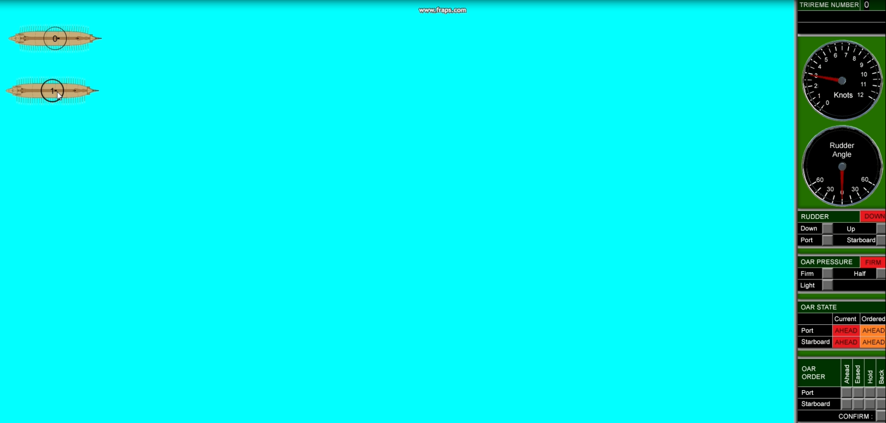

R Braithwaite
22 Nov 2019
Rev E

| Revision | Comments | Date |
|---|---|---|
| A |  | 23rd June |
| B | Quadratic functions for catch and finish phase |  |

## SUMMARY
SUMMARY
This report describes the development of a two-dimensional computer simulation of the powering and manoeuvring of a vessel powered by fixed seat rowing for the purpose of analysing the performance of oared warships.
Previous simulations of the dynamics of rowing have concentrated on maximising the, steady state, maximum speed of modern racing craft, and have generally been 1 dimensional in nature. Unlike these vessels, the capability of ancient oared warships was critically dependent on their ability to manoeuvre and accelerate in order to maximise the effect of their primary weapon system (the ram).
The ultimate expression of this technology was achieved in the Triremes developed in the 6th century BC by the Athenians. These warships are believed to pack 170 oarsmen into a vessel with an overall length of only 37m achieving a high power to weight ratio which, in turn, enabled high linear and rotational accelerations to be achieved.
In order to investigate these aspects of performance the simulation includes a two-dimensional manoeuvring model that enables the vessels velocity and acceleration in three degrees of freedom (surge, sway and yaw) to be calculated.
The physics of the oar system is modelled in a similar manner to previous models (calculating blade forces arising from lift and drag) but, due to the additional degrees of freedom considered, the variations in flow at the location of the oar blades (as she ship turns) are included in the simulation.
The model includes the ability to model individual or lumped (averaged) oars so that the effect of oar geometry and location on the vessel can be assessed.
The simulation is calibrated against sea trials conducted on the reconstruction of an Athenian Trireme in the 1980’s (Olympias).
Future applications of this computer simulation could include:
- Assessment of the revised oar arrangement proposed for a Mk 2 version of Olympias and suggest further potential optimisations,
- Assist with the design of future reconstructions of oared warships.
- The computer model could also be used for the analysis of comparative performance of earlier and later oared warships and help to understand the design of these important vessels, as well as analysing the relative performance of alternative oar system arrangements.
- Simulation of trireme combat tactics.

GLOSSARY
|  | Report Abbreviation | Code Variable Name |
|---|---|---|
| Inboard Oar Length | IL |  |
| Outboard Oar Length | OL |  |
| Oar Angle | ϴ |  |
| Oar Angle Range | ϴR |  |
|  |  |  |
|  |  |  |
|  |  |  |

Apparent mass (Ref page 21 of (1))

## BACKGROUND
BACKGROUND
Summary of models given in Carrera Paper Ref (2)
Ottenhoff  Ref (3)
Cabrera Ref (2)   (based on Alexander Ref (4))
Pope Ref (5)
Van Holst (6)
Atkinson (7)
Paper for Olympias by Andrew Taylor in Ref. (8) : modelled oar thrust as a linear function of speed
Also understood that a model for Olympias was produced by Tristan at UCL in 2006 (unpublished)
Ref 1 has a good summary of the other models:
Key differrnece (?)
“Kinematic Control” =  prescribed oar angle (Alexander and Cabeera?). Oar force calculated from oar velocity.
“Force control” = prescribed force applied by the rower perpendicular to the oar handle (Atkinson (and Van Holst?). These use iterative method to solve oar angle once oar force has been specified.

## MATHEMATICAL MODEL
MATHEMATICAL MODEL
This section sets out the physics used in the simulation.

### Ship Manoeuvring
Ship Manoeuvring

#### Equations of Motion
Equations of Motion
The axis system used is shown in Figure 1.
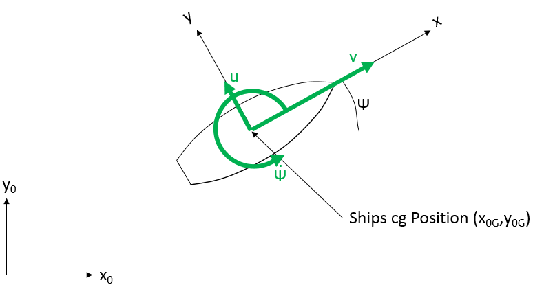

*Figure 1 Orientation of fixed and moving axes*

Where xo,yo are coordinates in the world axis system and x,y are coordinates of a point on the ship in the ship axis system.
The relationship between the two coordinate systems being as follows:
`x_{0} = x_{OG} +xcos ψ - ysin ψ` 				(3.1)
`y_{0} = y_{OG} +xsin ψ +ycos ψ`
Relating the forces in the ship axes(X,Y) to those in the world axis(XO,YO) system are:
`X = X_O cos ψ + Y_O sin ψ` 					(3.2)
`Y = -X_O sin ψ + Y_O cos ψ`
Relating the speed in world axis system (ẋ,ẏ) with those in the ship axis system(u,v):
`Ẋ_{OG} =ucos ψ - vsin ψ`  					(3.3)
`Ẏ_{OG} =usin ψ +vcos ψ`
Differentiating with respect to time:
`Ẋ[̈]_{OG} = u[̇] cos ψ - u ψ[̇] sin ψ- v[̇] sin ψ - v ψ[̇] cos ψ`  		(3.4)
`y[̈]_{OG} = u[̇] sin ψ +u ψ[̇] cos ψ+ v[̇] cos ψ - v ψ[̇] sin ψ`

Application of Newtons second law, the  equations of motion in these three degrees of freedom in the world axis system are:
`X_{0} =m x[̈]`  						(3.5)
`Y_{0} =m y[̈]`
`N=I ψ[̈]`
Where
m is the displacement
I is the mass moment of inertia about the center of gravity
Substituting 3.5 and 3.4 into 3.2 gives the equations of motion in the ship coordinates as:
`X =m (u[̇]-vψ[̇])` 					(3.6)		 `Y =m (v[̇]+uψ[̇])`
`N=I ψ[̈]`

For a vessel with port and starboard symmetry these hydrodynamic forces can be expressed as linear functions of hull velocities and accelerations as follows:
`X= X_U u+ X_{u[̇]} u[̇]`
`Y= Y_v v+ X_{v[̇]} v[̇] + Y_r r+ X_{r[̇]} r[̇]`
`N= N_v v+ N_{v[̇]} v[̇] + N_r r+ N_{r[̇]} r[̇]`
where
r= `ψ`
$$ X_U=(∂X)/(∂u) , Y_v=(∂Y)/(∂v) , N_v=(∂N)/(∂v)  etc. $$  `X_U = (∂X)/(∂u)  ,  Y_v = (∂Y)/(∂v)  ,  N_v = (∂N)/(∂v)   etc.`
The equations of motion then become:
`m (u[̇]-vr) = X_U u+ X_{u[̇]} u[̇]`
`m (v[̇]+ur) = Y_v v+ Y_{v[̇]} v[̇] + Y_r r+ Y_{r[̇]} r[̇]`
`I r[̇] = N_v v+ N_{v[̇]} v+N_rr+N_{r[̇]}r[̇][̇]`
Rearranging for the acceleration terms on the left hand side:
`(m-X_{u[̇]}) u[̇] = X_U u+m v r`
`(m-Y_{v[̇]}) v[̇] - Y_{r[̇]} r[̇] = Y_v v+ Y_r r-m u r`
$$ -N_{v[̇]}v[̇]+(I-N_{r[̇]})r[̇]=N_vv+N_rr $$  `- N_{v[̇]} v[̇] + (I-N_{r[̇]}) r[̇] = N_v v+ N_r r`
Or in matrix terms:
$$ ([(m-X_{u[̇]}) 0 0; 0 (m-Y_{v[̇]}) -Y_{r[̇]}; 0 -N_{v[̇]} (I-N_{r[̇]})])([u[̇] | v[̇] | r[̇]])=([X_Uu+mvr | Y_vv+Y_rr-mur | N_vv+N_rr]) $$  `([(m-X_{u[̇]}) 0 0; 0 (m-Y_{v[̇]}) -Y_{r[̇]}; 0 -N_{v[̇]} (I-N_{r[̇]})]) ([u[̇] | v[̇] | r[̇]]) = ([X_Uu+mvr | Y_vv+Y_rr-mur | N_vv+N_rr])`
$$ Mx[̇]=F $$  `M x[̇] =F`
Where
M is the Mass Matrix
F is the Force Matrix due to ship velocity.
Accelerations can be determined from known velocity terms as follows:
$$ x[̇]=M^{-1}F $$  `x[̇] = M^{-1} F`
Where
$$ M^{-1}=([(1)/(m-X_{u[̇]}) 0 0; 0 ((I-N_{r[̇]}))/((m-Y_{v[̇]})(I-N_{r[̇]})-Y_{r[̇]}N_{v[̇]}) (Y_{r[̇]})/((m-Y_{v[̇]})(I-N_{r[̇]})-Y_{r[̇]}N_{v[̇]}); 0 (N_{v[̇]})/((m-Y_{v[̇]})(I-N_{r[̇]})-Y_{r[̇]}N_{v[̇]}) ((m-Y_{v[̇]}))/((m-Y_{v[̇]})(I-N_{r[̇]})-Y_{r[̇]}N_{v[̇]})]) $$  `M^{-1} = ([(1)/(m-X_{u[̇]}) 0 0; 0 ((I-N_{r[̇]}))/((m-Y_{v[̇]})(I-N_{r[̇]})-Y_{r[̇]}N_{v[̇]}) (Y_{r[̇]})/((m-Y_{v[̇]})(I-N_{r[̇]})-Y_{r[̇]}N_{v[̇]}); 0 (N_{v[̇]})/((m-Y_{v[̇]})(I-N_{r[̇]})-Y_{r[̇]}N_{v[̇]}) ((m-Y_{v[̇]}))/((m-Y_{v[̇]})(I-N_{r[̇]})-Y_{r[̇]}N_{v[̇]})])`
In this case we will be interested in a full speed range from 0 knots to full speed and situations where rotational velocity will be significant so the linear force terms for rotational velocity and forward velocity (u and r) are replaced with quadratic terms. In addition, forces due to the action of rudders, oars and other devices (defined by column vectors a,b,c etc.) are added to the hydrodynamic forces due to ship motion and so the force matrix becomes:
`F= ([fX; fY; fZ]) = ([f(u^{2})+mvr | Y_vv+Y_rr-mur | N_vv+f(r^{2})]) +a+b+c+.....`   		(3.7)
The model uses a simple Euler numerical method for calculating the motion of the ship as follows
So, the equations used to derive accelerations become:
`u[̇] = (fX)/((m-X_{u[̇]}))`  						(3.8)
`v[̇] = ((I-N_{r[̇]})fY+Y_{r[̇]}fZ)/((m-Y_{v[̇]})(I-N_{r[̇]})-Y_{r[̇]}N_{v[̇]})`
`r[̇] = (N_{v[̇]}fY+(m-Y_{v[̇]})fZ)/((m-Y_{v[̇]})(I-N_{r[̇]})-Y_{r[̇]}N_{v[̇]})`

#### Manoeuvring Derivatives
Manoeuvring Derivatives

In the absence of any experimental values derived from model tests semi-empirical approximations based on basic hull dimensions of merchant ships (Ref. (9)) were used as follows:
(3.9)
$$ (-Y[́]_{v[̇]})/(π((T)/(L))^{2}=1+0.16C_B(B)/(T)-5.1((B)/(L))^{2}) $$  `(-Y[́]_{v[̇]})/(π((T)/(L))^{2}=1+0.16C_B(B)/(T)-5.1((B)/(L))^{2})`
$$ (-Y[́]_{r[̇]})/(π((T)/(L))^{2}=0.67(B)/(L)-0.003((B)/(T))^{2}) $$  `(-Y[́]_{r[̇]})/(π((T)/(L))^{2}=0.67(B)/(L)-0.003((B)/(T))^{2})`
$$ (-N[́]_{v[̇]})/(π((T)/(L))^{2}=1.1(B)/(L)-0.041(B)/(T)) $$  `(-N[́]_{v[̇]})/(π((T)/(L))^{2}=1.1(B)/(L)-0.041(B)/(T))`
$$ (-N[́]_{r[̇]})/(π((T)/(L))^{2}=(1)/(12)+0.017C_B(B)/(T)-0.33(B)/(L)) $$  `(-N[́]_{r[̇]})/(π((T)/(L))^{2}=(1)/(12)+0.017C_B(B)/(T)-0.33(B)/(L))`
$$ (-Y[́]_v)/(π((T)/(L))^{2}=1+0.40C_B(B)/(T)) $$  `(-Y[́]_v)/(π((T)/(L))^{2}=1+0.40C_B(B)/(T))`
$$ (-Y[́]_r)/(π((T)/(L))^{2}=-(1)/(2)+2.2(B)/(L-))0.080(B)/(T) $$  `(-Y[́]_r)/(π((T)/(L))^{2}=-(1)/(2)+2.2(B)/(L-)) 0.080 (B)/(T)`
$$ (-N[́]_v)/(π((T)/(L))^{2}=(1)/(2)+)2.4(T)/(L) $$  `(-N[́]_v)/(π((T)/(L))^{2}=(1)/(2)+) 2.4 (T)/(L)`
$$ (-N[́]_r)/(π((T)/(L))^{2}=(1)/(4)+)0.039B/T-2.4(B)/(L) $$  `(-N[́]_r)/(π((T)/(L))^{2}=(1)/(4)+) 0.039B/T-2.4 (B)/(L)`
Noting that Nr was replaced by a quadratic function for this model. (now changed to a constant to give the  observed turning rate at zero velocity.
These non-dimensional derivatives are dimensionalised as follows:
(3.10)
$$ Y[́]_{v[̇]}=(Y_{v[̇]})/(((1)/(2)ρL^{3})) $$  `Y[́]_{v[̇]} = (Y_{v[̇]})/(((1)/(2)ρL^{3}))`
$$ Y[́]_{r[̇]}=(Y_{r[̇]})/(((1)/(2)ρL^{4})) $$  `Y[́]_{r[̇]} = (Y_{r[̇]})/(((1)/(2)ρL^{4}))`
$$ N[́]_{v[̇]}=(N_{v[̇]})/(((1)/(2)ρL^{4})) $$  `N[́]_{v[̇]} = (N_{v[̇]})/(((1)/(2)ρL^{4}))`
$$ N[́]_{r[̇]}=(N_{r[̇]})/(((1)/(2)ρL^{5})) $$  `N[́]_{r[̇]} = (N_{r[̇]})/(((1)/(2)ρL^{5}))`
$$ Y[́]_v=(Y_v)/(((1)/(2)ρL^{2}U)) $$  `Y[́]_v = (Y_v)/(((1)/(2)ρL^{2}U))`
$$ Y[́]_r=(Y_r)/(((1)/(2)ρL^{3}U)) $$  `Y[́]_r = (Y_r)/(((1)/(2)ρL^{3}U))`
$$ N[́]_v=(N_v)/(((1)/(2)ρL^{3}U)) $$  `N[́]_v = (N_v)/(((1)/(2)ρL^{3}U))`
$$ N[́]_r=(N_r)/(((1)/(2)ρL^{4}U)) $$  `N[́]_r = (N_r)/(((1)/(2)ρL^{4}U))`

Where U is the combination of forward speed and sway. i.e.
`U=`

### Oar Model
Oar Model
The oar model allows for an oar to be placed at any position on the vessel as defined by the thole position in ship coordinates. All the characteristics entered for each oar are shown in Figure 2. If a negative y coordinate is specified for the thole the oar the arrangement is mirrored on the x axis to represent a starboard oar geometry.

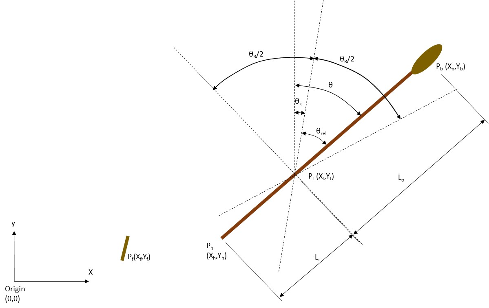

*Figure 2 Oar Characteristics*

Pt(xt,yt)			=position of thole in ships axes
Pf(xf,yf)			=position of oarsman’s footplate in ships axes
Pb(xb,yb)			=instantaneous location of oar-blade centroid in ships axes
Ph(xh,yh)			= instantaneous location of the center of the oar handle
Lo			= Outboard length of oar (to the center of the blade) projected onto xy plane
Li 			= Inboard length of oar	(to the center of the handle) projected onto xy plane
θ	= oar angle measured forward from the y axis for both port and starboard oars
θR	= Range of oar sweep (to extremes of motion)
θk	= Rake angle of oar system (mid sweep
θrel	= Oar angle relative to rake angle

For the purposes of calculating motion, and the resulting forces, the stroke is divided into four phases as shown in Figure 4
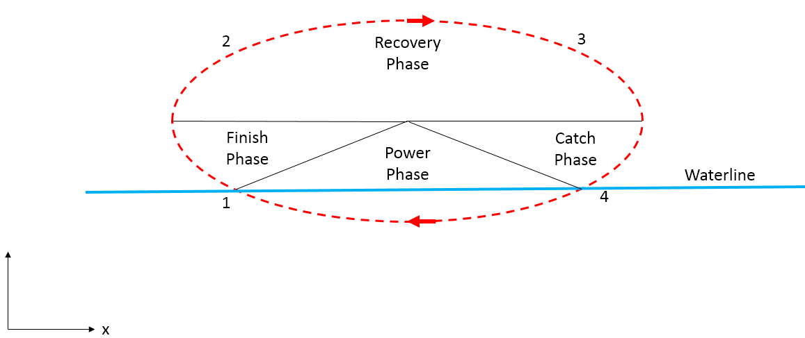

*Figure 4 Phases of the oar stroke*

The oar blade is assumed to instantly enter the water at the catch (4) and instantly leave the water at the finish (1).
The overall time between the finish and the catch (Return time) is defined such that:
Return time (tr)= Finish Phase(tf)+ Recovery Phase(tre)+ Catch Phase(tc)
Key variables controlling the oar stroke:
- Maximum load applied at the oar handle during the power phase.
- Effort put into the finish/catch to reverse the direction of the oar (as a percentage of the above).
- Total return time (tr).

These phases are identified by the phase variable as follows
Phase:
PHASE_FINISH
PHASE_RECOVERY
PHASE_CATCH
PHASE_POWER
Mode:
MODE_AHEAD:
- Oar angle initially set to θk
- Phase initially set to PHASE_RECOVERY
- t initially set to tr/2
- D set to 1
MODE_ASTERN:
- Oar angle initially set to θk
- Phase initially set to PHASE_RECOVERY
- t initially set to tr/2
- D set to -1
MODE_EASED:
- Oar angle initially set to θk
- Phase set to PHASE_RECOVERY
MODE_STOP
- Oar angle initially set to θk
- Phase set to PHASE_POWER

#### Finish Phase
Finish Phase

During this phase air resistance is currently ignored and the only forces acting on the oar are assumed to be the handle force so the equation of motion becomes:
$$ Iω[̇]=M=F^'L_i $$  `Iω[̇] =M= F^' L_i`
Where:
I = moment of inertia of the oar about the thole
M = the moment of the handle force about the thole
F’ = the Handle force perpendicular to the oarshaft
Li = the inboard length of the oar to the center of the oar handle
For simplicity a constant moment is assumed to be applied by the oarsman throughout this phase (approximating to equal force at the handle).
The motion is controlled by defining the magnitude of this moment.
This will then determine what the finish angle needs to be to enable the oar angular velocity to be brought to zero at the end of the stroke. This in turn will be a function of the oar angular velocity at the finish.
So for a given angular velocity at the finish ( ωf) the angular travel required to stop the oar is equal to:
$$ distanceToTravel=(ω_f^{2})/(2((M_f)/(I))) $$  `distanceToTravel= (ω_f^{2})/(2((M_f)/(I)))`
Where Mf = the constant finish moment
The finish angle θf  needs to be chosen such that:
$$ θ_f=-D((θ_R)/(2)-distanceToTravel) $$  `θ_f =-D ((θ_R)/(2)-distanceToTravel)`
Where D is the oar direction variable
As this implies constant angular acceleration, the following polynomial functions of time have been used to describe the motion (with t=0 at the start of the finish phase):
$$ θ_{rel}=At^{2}+Bt+C $$  `θ_{rel} =A t^{2} +Bt+C`
$$ ω=2At+B $$  `ω=2At+B`
$$ ω[̇]=2A $$  `ω[̇] =2A`
Where
`θ_{rel} = θ -θ_k`
t = time since the beginning of the finish phase

As the angular acceleration has already been determined:
$$ A=D(ω[̇])/(2)=D(M_f)/(2I) $$  `A=D (ω[̇])/(2) =D (M_f)/(2I)`
At t=0
- `θ = θ_k +θ_f`
- `ω = ω_f`
Hence					  `  C = θ_k +θ_f`
` B= ω_f`
PHASE_FINISH ends once the oar angle has reached the maximum travel.
The time for this to occur is given by :
$$ t_f=((ω_f)/(ω[̇])) $$  `t_f = ((ω_f)/(ω[̇]))`

Once t has exceeded this number the finish phase has reached an end and phase is set to PHASE_RECOVERY.

#### Recovery Phase
Recovery Phase

The catch phase (discussed below) is assumed to be a mirror image of the finish phase.
Therefore, the recovery phase is assumed to start when θ=-D.θR/2 and end when θ=D.θR/2
Since tf = tc the time available for the recovery phase tre = tr-2tf
The acceleration is assumed to vary linearly with time for this phase to allow for continuity of position and velocity t start and end together with the ability to vary the time (to allow for different ratios of power to recovery time).
Hence a cubic function of oar angle against time is chosen:
$$ θ_{rel}=At'^{3}+Bt'^{2}+Ct'+D $$  `θ_{rel} =A t'^{3} +B t'^{2} +Ct'+D`
$$ ω=3At^{'2}+2Bt'+C $$  `ω=3A t^{'2} +2Bt'+C`
$$ ω[̇]=6At'+2B $$  `ω[̇] =6At'+2B`
Where
t’ = time since the start of the recovery phase = t-tf
At t’=0:
`θ_{rel} =-D (θ_R)/(2)` =D
$$ ω=0=C $$  `ω=0=C`
At t’=tre:
`ω=0=3A t_{re}^{2} +2B t_{re}` 		(i)

`θ_{rel} =D (θ_R)/(2) = A t_{re}^{3} +B t_{re}^{2} -D (θ_R)/(2)`
`D θ_R = A t_{re}^{3} +B t_{re}^{2}` 	(ii)

`ω=- ω_f =3A t_{re}^{2} +2B t_{re} - ω_f` 		(ii)
From (i):
$$ A=-(2B)/(3t_{re}) $$  `A=- (2B)/(3t_{re})`
Substituting into (ii) gives:
$$ B=3(θ_R)/(t_{re}^{2}) $$  `B=3 (θ_R)/(t_{re}^{2})`

#### Catch Phase -CORRECT CODE (in set mode method and update oar stroke method)
Catch Phase -CORRECT CODE (in set mode method and update oar stroke method)
This phase is a mirror image of the Finish phase with the following equations of motion:
$$ θ_{rel}=At'^{2}+Bt'+C $$  `θ_{rel} =A t'^{2} +Bt'+C`
$$ ω=2At'+B $$  `ω=2At'+B`
$$ ω[̇]=2A $$  `ω[̇] =2A`
Where t’ is the elapsed time since the start of the catch phase:
t’=t-tre-tf
At t’=0
$$ θ_{rel}=D(θ_R)/(2)=At'^{2}+Bt'+C $$  `θ_{rel} =D (θ_R)/(2) =A t'^{2} +Bt'+C`
`ω=0=B`
At t’=tf
$$ θ_{rel}=Dθ_f=At_f^{2}+Bt_f+C $$  `θ_{rel} =D θ_f =A t_f^{2} +B t_f +C`
`ω=-D ω_f =2A t_f +B`

Hence:
$$ A=-(Dω_f)/(2t_f) $$  `A=- (Dω_f)/(2t_f)`
$$ B=0 $$  `B=0`
$$ C=D(θ_R)/(2) $$  `C=D (θ_R)/(2)`
Once t>tr the catch is considered to occur and the phase variable is set to POWER_PHASE

#### Power Phase
Power Phase

At the start of the power phase. The oar angle starts at θc
For subsequent timesteps the oar angular velocity is determined by a defined by a function that is assumed to reflect the oarsmans ability to apply force to the oar handle (See next section).
At each timestep a calculation is carried out to work out the angular distance that the that the oar would have travel if decelerated at a constant rate by the amount of effort selected for the finish/catch phase. As the deceleration is constant this is calculated as follows:
$$ distanceToTravel=(ω^{2})/(2ω[̇]_f) $$  `distanceToTravel= (ω^{2})/(2ω[̇]_f)`
If this distance is greater than or equal to the  remaining angular distance to the end of the stoke then the power phase is ended and the m_phase variable is set to PHASE_FINISH.
i.e. power phase ends when:
$$ (ω^{2})/(2ω[̇]_f)-((θ_R)/(2)-Dθ_{rel})>0 $$  `(ω^{2})/(2ω[̇]_f) - ((θ_R)/(2)-Dθ_{rel}) >0`
At the end of the power phase the time t = thee time for a complete stroke so that the stroke rate (strokes per minute) can be calculated as:
$$ SPM=(60)/(t) $$  `SPM= (60)/(t)`
T is then set to zero for the start of the next stroke.

#### Calculating Forces and Moments
Calculating Forces and Moments

This section describes how the forces oar are calculated for a given oar angle (θ) and angular velocity (ω).
The forces and moments calculated in the model are  shown in Figure 3.
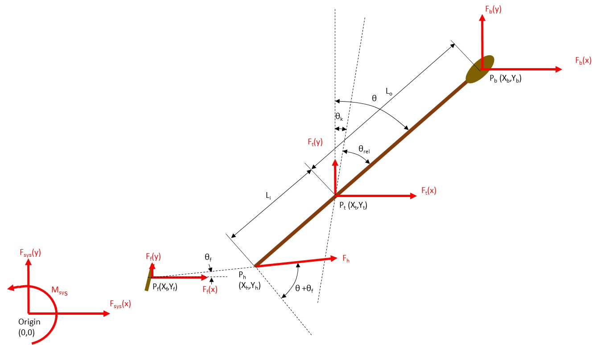

*Figure 3 Oar system forces*

Fb(Fb(x),Fb(y)) 		Forces exerted on the centroid of the oar blade by the water
Fh			Force exerted by the oarsman on the oar handle
Ft(Ft(x),Ft(y)) 		Reaction force exerted on the ship at the thole by the oar
Ff(Ff(x),Ff(y)) 		Reaction force exerted on the ship foot plate by the oarsman
Fsys(Fsys(x),Fsys(y),Msys)	Forces and moments passed back to the ship manoeuvring model, resulting from the reaction forces at the thole and foot plate.
The oar blade forces are only calculated during the power phase. Loading from resistance in air is ignored.
Oar blade forces calculated as follows:
Oar blade position calculated as follows:
Pb(x)=Pt(x)+ Lo sinθ
Pb(y)=Pt(y)+ sideLocosθ
where
side = 1 if thole(y)>0 else side =-1
The relevant velocities and forces are presented in Figure 5
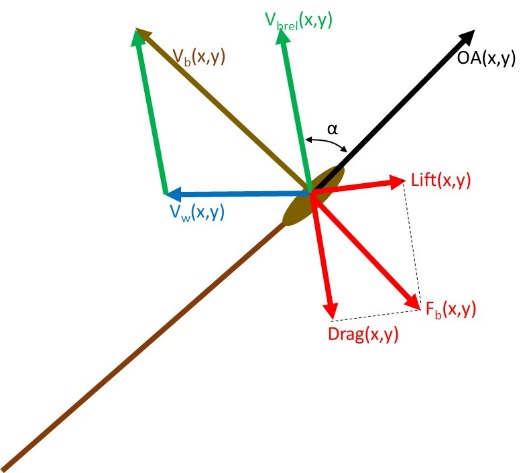

*Figure 5 Blade Velocities and Forces*

Vb(x,y)  			= blade centroid velocity in ships axes
Vw(x,y) 			= Water velocity at the blade centroid in ships axes
Vbrel(x,y)		= blade velocity relative to water
α 			=angle of attack of oar blade
Velocity of the oar blade (in ships axes) is calculated as:
Vb(x) =  Lo  ω cosθ
Vb(y)= -side.Lo ω sinθ
where
ω = Oar angular velocity (radians/second)
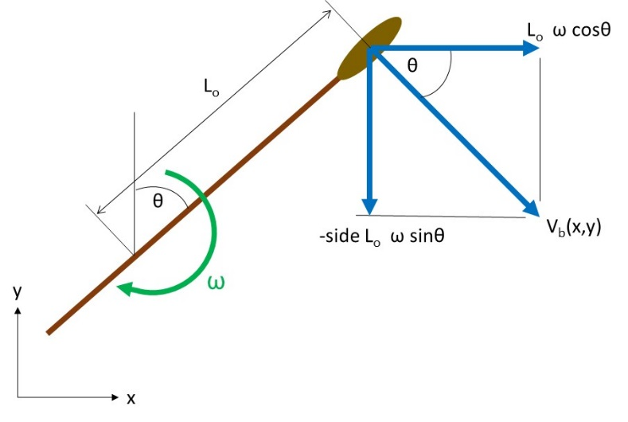

*Figure 6 Port Blade Velocity Components*

Water velocity at the oars centroid (Vw)is dependent on the ships velocity vector (u,v,r)
$$ V_w(x)=-u+side..cos(θ).r $$  `V_w (x) = - u+side. . cos(θ) .r`
$$ V_w(y)=-v-.sin(θ).r $$  `V_w (y) = - v - . sin(θ) .r`
The velocity of the oar blade relative to the water is then given by:
Vbrel(x)= Vb(x) – Vw(x)
Vbrel(y)= Vb(y) – Vw(y)
The angle of attack of the oar aerofoil is calculated as the angle between the OVW vector and an oar direction vector (OA) where:
OA(x) = sinθ
OA(y) = side.cosθ
The angle of attack is then calculated using the vector dot product relationship:
$$ OA•V_{brel}=(OA)(V_{brel})cos((α)) $$  `OA • V_{brel} = (OA) (V_{brel}) cos((α))`
Where AOA is the angle between the two vectors, hence:
$$ α=acos(((V_{brel}[x].OA[x]+V_{brel}[y].OA[y])/())) $$  `α =a cos(((V_{brel}[x].OA[x]+V_{brel}[y].OA[y])/()))`
(since the magnitude of OA is 1)
It should be noted that this equation does not distinguish between the angle of attack being clockwise or anticlockwise.
If this angle is greater that Pi/2 then the angle is reset as:
α=π-α
And the oar direction vector is reversed:
OA[x]=-1xOA[x]
OA[y]=-1xOA[y]
This is intended to reflect the symmetry of the oar blade and keep the angle of attack between 0 and Pi/2 radians
The lift and drag coefficients for the oar blade at this angel of attack are based on experiments carried out by Caplan and Gardiner (Ref (10)) to find lift and drag forces on oar blades. The data that they collected for the macon blade can be closely approximated by:
$$ C_D=2.sin((α))^{2} $$  `C_D =2. sin((α))^{2}`
$$ C_L=sin((2.α)) $$  `C_L = sin((2.α))`

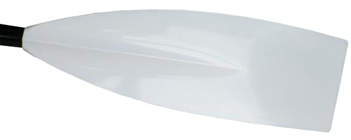

*Figure 7 Macon Oar Blade*

*Figure 8 Oar Blade Lift and Drag Coefficients*

The magnitude of the Lift and Drag Forces are then calculated as:
Lift = 0.5.rho.EffA.|Vbrel|2.CL
Drag = 0.5.rho. EffA.|Vbrel|2.CD
Where:
EffA 		= effective area of the Oar blade
|Vbrel| 		=magnitude of the Vbrel vector.
The x and y components of lift and drag are calculated as follows:
Lift(x)= side*Lift.Vbrel(y)/ |Vbrel|
Lift(y)=-side* Lift. Vbrel (x)/ |Vbrel|
Drag(x)=-Drag. Vbrel (x)/ |Vbrel|
Drag(y)=-Drag. Vbrel (y)/ |Vbrel|
An additional step is required to distinguish between the case of α being clockwise or anticlockwise (so as to define the lift vector direction correctly):

The angle between the lift vector (calculated above) and the Oar direction vector (OA) is calculated:
$$ θ_{2}=acos((Lift(x)OA(x)+Lift(y)OA(y))/()) $$  `θ_{2} =acos ((Lift(x)OA(x)+Lift(y)OA(y))/())`
If this angle is less than π/2 then the lift vector is correct, if not then the lift vector is reversed:
Lift(x)=-Lift(x) and Lift(y)=-Lift(y)
The oarforces vector is then calculated as follows:
Fb(x)=Lift(x)+Drag(x)
Fb(y)=Lift(y)+Drag(y)
The moment of these forces about the thole is calculated as follows:
$$ bladeForceMoment=F_{b(y)}(P_{b(x)}-P_{t(x)})-F_{b(x)}(P_{b(y)}-P_{t(y)}) $$  `bladeForceMoment= F_{b(y)} (P_{b(x)}-P_{t(x)}) - F_{b(x)} (P_{b(y)}-P_{t(y)})`
There is an additional oar moment about the thole due to the rotational inertia of the oar
$$ oarInertiaMoment=side*Iω[̇] $$  `oarInertiaMoment= side*Iω[̇]`
It is assumed that the force that the oarsman exerts at the handle to overcome these moments acts is a straight line between the position of his hands and the position of his feet on the foot rest this line is at an angle to the ship centreline off θf (see Figure 3) where:
$$ θ_f=atan((P_{h(y)}-P_{f(y)})/(P_{h(x)}-P_{f(x)})) $$  `θ_f =atan ((P_{h(y)}-P_{f(y)})/(P_{h(x)}-P_{f(x)}))`
The magnitude of this force is given by:
$$ F_h=-side*((bladeForceMoment+oarInertiaMoment)/(L_icos(θ+side*θ_f))) $$  `F_h =-side* ((bladeForceMoment+oarInertiaMoment)/(L_icos(θ+side*θ_f)))`
The oarsman places a force on the foot plate that is equal to this force plus the force required to accelerate the part of his body that moves with the oar as he executes his stroke.
This force is considerably less significant in the case of Olympias than it is in racing shells because:
- The oarsmen are on fixed seats and only thee upper half of the body moves with the stroke.
- The mass of the oarsmen as a proportion of the ships displacement is considerably less
In this model the moving part of the oarsman is considered as a single point mass that is instantaneously moving along the line that connects the center of the handle with the center of the  foot plate.
Furthermore, this point mass is assumed to move in a fixed proportion to the movement of the oar handle.
The acceleration of the oar handle perpendicular to the oar shaft is given by:
$$ L_iω[̇] $$  `L_i ω[̇]`
The component of this acceleration in the direction of the footplate is given by:
$$ L_iω[̇]cos(θ+side*θ_f) $$  `L_i ω[̇] cos (θ+side*θ_f)`
The movement of the moving mass of the oarsman is a proportion of this (by a kinematic factor A calculated below), so that the acceleration of this mass in the direction of the footplate is given by:
$$ L_iω[̇]cos(θ+side*θ_f)A $$  `L_i ω[̇] cos (θ+side*θ_f) A`
So, the magnitude of the force on the foot plate is given by:
$$ (F_f)=-F_h+L_iω[̇]cos(θ+side*θ_f)A.m_r $$  `(F_f) =- F_h + L_i ω[̇] cos (θ+side*θ_f) A. m_r`
Where
mr is the mass of the moving part of the oarsman.
The components of this force in ship axes are:
$$ F_{f(x)}=(F_f)cosθ_f $$  `F_{f(x)} = (F_f) cos θ_f`
$$ F_{f(y)}=(F_f)sinθ_f $$  `F_{f(y)} = (F_f) sin θ_f`
NOTE: This ignores the effects of boat acceleration on the oar as this is dealt with in the ship manoeuvring equations that treat the ship as a ridged body including the mass of the oars and oarsmen.
The forces at the thole pin are calculated by resolving the forces acting at the oar blade and handle in the x and y directions (and multiplying by -1 to give the reaction force on the boat:
$$ F_t(x)=(F_hcos(θ_f)+F_b(x)) $$  `F_t (x) = (F_hcos(θ_f)+F_b(x))`
$$ F_t(y)=(-F_hsin(θ_{kf})+F_b(y)) $$  `F_t (y) = (-F_hsin(θ_{kf})+F_b(y))`
The forces at the thole pin and foot plate that are transmitted to the ship are then calculated as:
$$ F_{sys}(x)=F_{t(x)}+F_{f(x)} $$  `F_{sys} (x) = F_{t(x)} + F_{f(x)}`
$$ F_{sys}(y)=F_{t(y)}+F_{f(y)} $$  `F_{sys} (y) = F_{t(y)} + F_{f(y)}`
$$ F_{sys}(z)=F_{f(y)}P_{f(x)}-F_{f(x)}P_{f(y)}+F_{t(y)}P_{t(x)}-F_{t(x)}P_{t(y)} $$  `F_{sys} (z) = F_{f(y)} P_{f(x)} -F_{f(x)} P_{f(y)} + F_{t(y)} P_{t(x)} -F_{t(x)} P_{t(y)}`

Calculation of Oarsman Inertial Load:

Assumes rower weight of 75 kg.
| Part of Body | Proportion of mass (Ref (11) | mass | Movement (proportion of stroke) |
|---|---|---|---|
| Head | 7.3% | 5.48 kg | 0.857 |
| Torso | 50.8% | 38.1 kg | 0.429 |
| Upper arms (both) | 5.4% | 4.05 kg | 0.857 |
| Forearms (both) | 3.2% | 2.4 kg | 1.0 |
| Hands (both) | 1.32 % | 0.99 kg | 1.0 |
| TOTAL (moving mass) | 68.02% | 51.02 kg | 0.547 |

*Table 1 Moving mass of rower as a proportion of stroke (see Figure 11)*

The
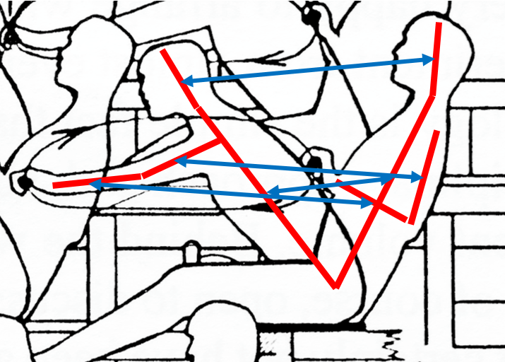

*Figure 11 Body movement during stroke on Olympias (Ref (12)*

#### Calculating Work and Power
Calculating Work and Power
Work and power are calculated at the oar handle
The incremental work completed at each step is calculated from the moment of the handle force about the thole multiplied by the angular velocity of the oar:
$$ ΔWork_t=IL.handleForce.cosθω.timestep $$  `ΔWork_t =IL.handleForce. cosθω.timestep`
Work is set to set at the beginning of the stroke (defined as the finish) and at subsequent timestep up to the next finish the incremental work is summed and at the end of the next stroke.
The average power over the complete stroke is then calculated as follows:
$$ Power=(nary_{t=0}^{t=t_s} ΔWork_t)/(t_s) $$  `Power= (nary_{t=0}^{t=t_s} ΔWork_t)/(t_s)`

#### Determination of Oar Angular Velocity and Timing
Determination of Oar Angular Velocity and Timing

For a given boat velocity the key variable that determines oar forces is the angular velocity of the oar. The angular velocity at which the oarsman can drive the oar will depend on how much force he is able to apply at the oar handle and the resistance which he experiences in terms of:
- Air resistance
- Overcoming the inertia of the oar
- Water resistance at the oar blade
Three methods of determining angular velocity are available:
Stroke Oar

For MODE_STOP
Oar angle is maintained at :		θ= rake
Oar angular velocity is maintained at: 	ω=0
The oar handle force is determined as described above. If this oar handle force exceeds the maximum defined by the intercept in Figure 10, then all blade forces and the handle force are scaled to this number. This is intended to represent the oarsman feathering the oar (or limiting its immersion) to limit the loading to his strength.
For MODE_AHEAD or MODE_ASTERN
Here the oar angular velocity is found iteratively in order to comply with an assumed oar handle force curve, based on (find reference)
This force curve is a function of both oar angle and time.
From the catch to mid stroke (i.e. when the oar angle = rake) the function is:
$$ Target blade force moment=maximum moment.(1-(relative oar angle^{2})/((catchFactor.(range)/(2))^{2})) $$  `Target blade force moment=maximum moment. (1-(relative oar angle^{2})/((catchFactor.(range)/(2))^{2}))`
Where
catchFactor = is a factor to ensure that the handle force is continuous across the catch:
$$ catchFactor=(1)/((1-(blade force moment At Catch)/(maximum moment))) $$  `catchFactor= (1)/((1-(blade force moment At Catch)/(maximum moment)))`
From midstroke to the finish the catch factor is removed so that:
$$ Target blade force moment=maximum moment.(1-(relative oar angle^{2})/(((range)/(2))^{2})) $$  `Target blade force moment=maximum moment. (1-(relative oar angle^{2})/(((range)/(2))^{2}))`
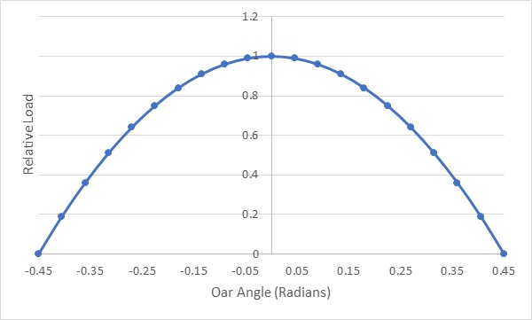

*Figure 9 Oar handle force function (catchFactor = 1)*

The maximum force parameter is also defined as a linear function of the magnitude of ship speed (defined by an intercept and gradient) to reflect ability of muscles to impose a greater load at slower strain rates. (look at “Hill factor for this based on muscle contraction rate)
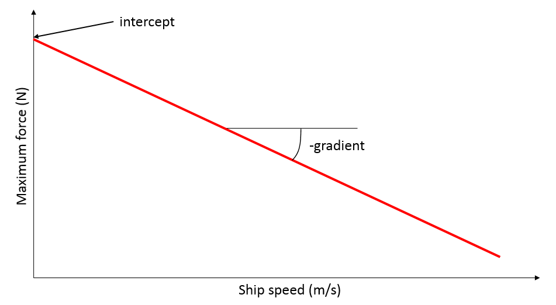

*Figure 10 Maximum oar handle force function*

A first approximation of the oar angular velocity is determined as follows:
$$ ω_{1}=direction((W(x)-))/(OL) $$  `ω_{1} =direction ((W(x)-))/(OL)`
The method described in section Error! Reference source not found. is then used to calculate the blade force moment (moment1) and the difference from the required target value is calculated as follows:
$$ error1=moment1-direction.arget blade force moment $$  `error1=moment1-direction.arget blade force moment`
(Note moment multiplied by side to correct for port starboard)

The secant method is then used to iterate to an oar angular velocity that reduces this error between the handle force and the handle force target below a defined limit.
In this case if oar handle force exceeds the maximum defined by Figure 10, then all blade forces and the handle force are scaled to this number.
Follow Oar

In this case the oar follows the stroke oar.
Forces are calculated after the Stroke oar has been updated and the following stroke oar variables are passed into the function.
- direction
- powerStoke
- oarAngle
- oarAngularVelocity
The handle and blade forces calculated may differ from those calculated for the stroke oar if the local water velocity differs (e.g. in a turn).
The oar will precisely follow the angle of the  stroke oar, hence maintaining clearances between blades as is desirable in a tightly packed oars system such as is believed to have existed in an Athenian trireme.
However, the potential for the calculated loads to differ can mean that some oars will be underloaded and some will be overloaded.
Timed Oar

In this case the

#### Inertial forces
Inertial forces

NOT IMPLEMENTED IN SIMULATION

### Rudder Model
Rudder Model

The Rudder is modelled as an aerofoil located at (stockX, stockY) in the ship axis system with rudder angle as shown in Figure 12.

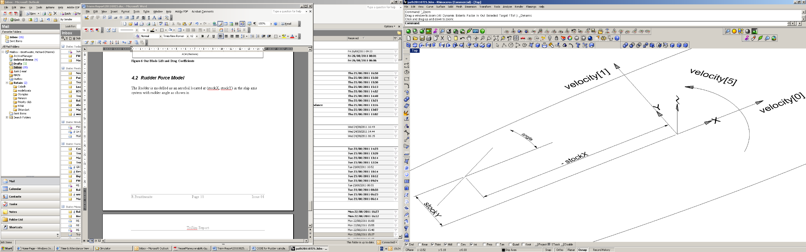

*Figure 12 Rudder Location*

The calculation and nomenclature for the rudder forces is carried out in a similar way to the oar forces:
As the rudder blade is not moving relative to the ship axes, the velocity vector of the rudder blade relative to the water (OVW) is given by:

check e.g. change angle -> angleR
where angleR = atan(stocky/stockX)

The unit rudder direction vector is given by:

OA[0] = cos(angle)
OA[1] = sin(angle)

And the angle of attack of the rudder blade is given by:

Again, if AOA>Pi/2 the angle is reset and OA is reversed as for the oar model.

The Lift and drag forces are then calculated in the same way as for the oars, using the same expression for lift and drag coefficients.
The form resistance of the rudder is added to these drag factors

The x and y components of lift and drag are calculated as follows:

Lx=Lift.OVW[1]/OVWmag
Ly=-Lift.OVW[0]/OVWmag
Dx=Drag.OVW[0]/OVWmag
Dy=Drag.OVW[1]/OVWmag

Again, as with the oar model the angle between the lift vector and the oar direction vector is checked to ensure that the lift vector is correctly oriented.

And the components of the rudderforces vector calculated in the same way as the oarforces vector.

## SOFTWARE IMPLEMENTATION
SOFTWARE IMPLEMENTATION

## APPPLICATION TO OLYMPIAS
APPPLICATION TO OLYMPIAS

### Olympias design Parameters
Olympias design Parameters

#### Hull Parameters
Hull Parameters

The following hull parameters have been used in the simulation:
| Parameter | Value | Reference |
|---|---|---|
| Displacement (includes added mass) | 46 tonnes | Ref (1) page21 |
| Draught | 1.08m | Interpolation of hydrostatics (Ref (13)) |
| Waterline beam | 3.6m | Measured from Olympias midship section drawing (Ref (14)) |
| Waterline Length | 33m | Measured from Olympias General Arrangement drawing (Ref. (15)) |
| Mass moment of inertia about z axis through center of gravity | 4 x 106 kg m2 | Andre Taylor model described in page 232 Ref (16) |

Table 2 Olympias Hull Parameters

#### Resistance
Resistance

The report for the 1988 sea trials of Olympias include the results of towing tests used to determine the actual resistance of the full sized reconstruction.
Polynomial fit data was given for the hull with the rudders raised and with the rudders fully immersed (Ref (1) page 74) (in terms of the speed in knots) as follows:
Rudders raised:
0-6.7 knots:    		40.2 v2				(N)		(5.1)
6.7-9 knots:		75.2 v2 – 1560 			(N)
9+ knots:		88.6 v2 - 2640			(N)
Rudders lowered:
0-6.7 knots:    		76.6 v2				(N)		(5.2)
6.7-9 knots:		(75.2 v2 – 1560) + 1780v2/49 	(N)
9+ knots:		(88.6 v2 – 2640) + 1780v2/49	(N)
These include the effect of the apparent headwind (v kts).
For the purpose of this program single polynomials were fitted for the whole speed range (0-12 knots) as follows:
Rudders raised: 	51.4 v3 -76.0 v2 +223 v		(N)		(5.3)
Rudders lowered:	38.0 v3 + 170.0 v2 + 25 v		(N)
where v is in m/s
A comparison of these polynomials with those published in the Sea Trials report is given in Figure 13 and Figure 14.

*Figure 13 Resistance with rudders raised*

*Figure 14 Resistance with rudders down*

The  resistance with the rudders raised was used for the simulation.
The resistance of the rudders was separated by fitting a curve to the difference between the two curves:
Rudders only:		137.0 v2 + 0.65 v		(N)
The fit curves used in the program are plotted in

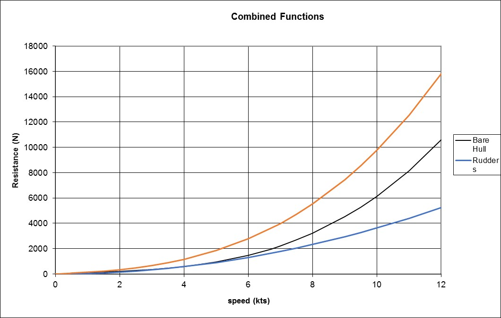

*Figure 16 Resistance functions used in simulation*

#### Turning and manoeuvring
Turning and manoeuvring

Stationary Turning
From sea trials on Olympias Stationary turning Zygian and Thranite only at 27 only managed a rate of turn of 3.5 degrees/second Ref (1) p30

Turning Circles

Zig-Zag manoeuvre
Helm 22.5 deg to port
When heading = +20 degrees helm 22.5 degrees to starboard
When heading = -20 degrees helm 22.5 degrees to port
First overshoot recoded as 8 degrees subsequent overshoots as 7 degrees (Ref (1) p 30)
Fit of the model
Ability to manoeuvre will depend on the moment achievable by the rowing system and the resistance to turning of the  hull
The value for Nr is

#### Oar system
Oar system

The original oar system consisted of different oar designs for each level (as shown in Figure 15 and Figure 16) with shortened versions at the extreme bow and stern.
The properties of these oars used in the simulation are given in Table 3.
|  | Thranite | Zygian | Thalmian | Short Zygian | Short Thalmian | Ref |
|---|---|---|---|---|---|---|
| Length overall (m) | 4.220 | 4.220 | 4.220 | 4.000 | 4.000 |  |
| Length inboard(m) | 1.050 | 1.050 | 1.050 | 0.889 | 0.889 |  |
| Length of handgrip(m) | 0.230 | 0.230 | 0.230 | 0.230 | 0.230 |  |
| Distance from thole to center of gravity (m) | 0.280 | 0.320 | 0.250 |  |  |  |
| Distance of center of blade from end of blade (m) | 0.297 | 0.330 | 0.363 | 0.330 | 0.363 |  |
| outboard length to center of blade (m) | 2.873 | 2.840 | 2.807 | 2.781 | 2.748 |  |
| inboard length to center of handle (m) | 0.935 | 0.935 | 0.935 | 0.774 | 0.774 |  |
| Moment of inertia about thole (kg m2) |  | 30 |  |  |  |  |
| Weight (kg) | 17 | 17 | 14 |  |  |  |
| Area of blade (m2) | 0.113 | 0.113 | 0.109 | 0.113 | 0.109 |  |
| Rake of oars (degrees) | 4 | 8 | 9 | 8 | 9 |  |
| Angle θ (degrees) | 32 | 24 | 13 |  |  | (Figure 16) |
| Effective stroke length at center of handle |  |  |  |  |  |  |

Table 3 Oar properties

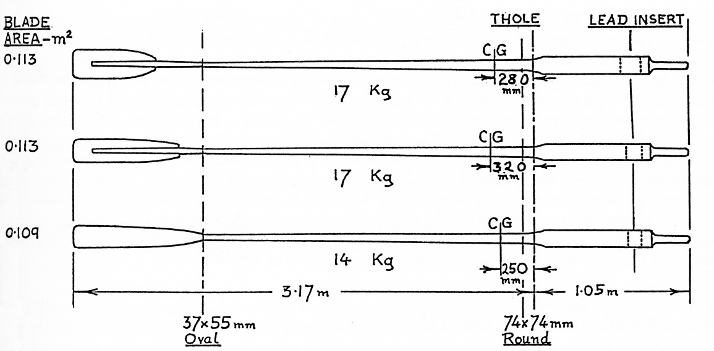

*Figure 15 Original Oars (From ref (1))*

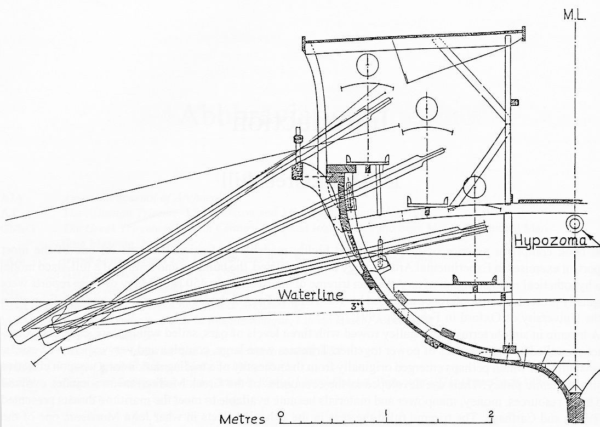

*Figure 16 Olympias original oar configuration (ref (1))*

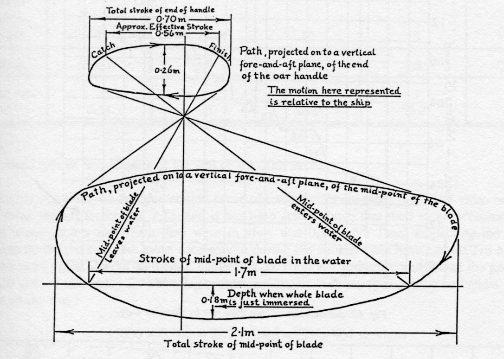

Particuarly skilled Thranite (Ref (1) p 28):
Stroke took 1.8 seconds. In the water for 0.7 seconds Catch and finish 0.2 seconds rhythm factor 2.6 stroke. Stroke lennth of 0.7m compared with achievable length (at butt end) of 1.0m
Speed = 3.3 knots ?(Ref (1) p 50)
Moment of inertia = 30 kmm2?
Speed and Acceleration Trials
Video record of Ship Acceleration (Thranites only)
Rudders fully immersed

## VALIDATION
VALIDATION
Validation against sea trial results for Olympias

## SOFTWARE ARCHITECTURE
SOFTWARE ARCHITECTURE
Validation against sea trial results for Olympias

## APPENDIX SOURCE CODE
APPENDIX SOURCE CODE

## REFERENCES
REFERENCES
1. J F Coates, S K Platis, T J Shaw. The Trireme Trials 1988: Report on the Anglo-Hellenic Sea Trials of Olympias. s.l. : Oxbow Books, 1988.
2. Cabrera D, Ruina A Kleshnev V. A simple 1+ dimensional model of rowing mimics observed forces and motions. s.l. : Cornell University, 2006.
3. E, Ottenhoff. Modelling the rowing stroke. s.l. : University of Groningen, 2003.
4. F, Alexander. The therory of rowing. s.l. : Proceedings of the University of Durham Philosophical Society (pp. 169-179), 1925.
5. D, Pope. On the dynamics of men and boats and oars. s.l. : Mechanics and Sport ASME (pp. 113-130), 1973.
6. M, Van Holst. On Rowing. [Online] January 2017. [Cited: 04 May 2019.] http://home.hccnet.nl/m.holst/RoeiWeb.html.
7. W, Atkinson. Rowing computer research. [Online] 16 01 2019. [Cited: 04 05 2019.] http://www.atkinsopht.com/row/rowrpage.htm.
8. Rankov, B. Trireme Olympias: The final report. s.l. : Oxbow Books, 2012.
9. The application of manoeuvring criteria in hull design using linear theory. D Clarke, P Gedling, G Hine. s.l. : The Royal Institution of Naval Architects, 1982.
10. A fluid dynamic investigation of the bib blade macon oar blade designs in rowing propulsion. Gardiner, N Caplan T. s.l. : Journal of sports sciences, 2007, Vol. 25.
11. Tozeren, A. Human Body Dynamics Classical Mechanics and Human Movement. s.l. : Springer, 2000.
12. Shaw, T. The Tireme Project Operational experience 1987-90 Lessons learnet. s.l. : Oxbow Books, 1993.
13. Report of inclining experiment and stability analysis of HM Olympias. s.l. : BMT Defence Services, 1991. TR001/R1952 Issue 01.
14. Coates, J F. Plan No 8: Trires: Arrangement off Mid Section. 1984.
15. Cooates, J F. Trieres General Arrangement. 1985.
16. Rankov, B. Trireme Olympias Final Report. s.l. : Oxbow Books, 2012.
17. J S Morrison, J E Coates, N B Rankov. The Athenian Trireme. 2000 : Cambridge University Press.

Contents
1	SUMMARY	3
2	BACKGROUND	7
3	MATHEMATICAL MODEL	8
3.1	Ship Manoeuvring	8
3.1.1	Equations of Motion	8
3.1.2	Manoeuvring Derivatives	10
3.2	Oar Model	12
3.2.1	Finish Phase	14
3.2.2	Recovery Phase	15
3.2.3	Catch Phase	16
3.2.4	Power Phase	17
3.2.5	Calculating Oar Forces	17
3.2.6	Determination of Oar Angular Velocity and Timing	21
3.2.7	Inertial forces	24
3.3	Rudder Model	25
4	SOFTWARE IMPLEMENTATION	27
5	APPPLICATION TO OLYMPIAS	27
5.1	Olympias design Parameters	27
5.1.1	Hull Parameters	27
5.1.2	Resistance	27
5.1.3	Oar system	29
6	VALIDATION	31
7	SOFTWARE ARCHITECTURE	32
8	REFERENCES	32
9	APPENDIX SOURCE CODE	34

REFERENCES
1. J F Coates, S K Platis, T J Shaw. The Trireme Trials 1988: Report on the Anglo-Hellenic Sea Trials of Olympias. s.l. : Oxbow Books, 1988.
2. Cabrera D, Ruina A Kleshnev V. A simple 1+ dimensional model of rowing mimics observed forces and motions. s.l. : Cornell University, 2006.
3. E, Ottenhoff. Modelling the rowing stroke. s.l. : University of Groningen, 2003.
4. F, Alexander. The therory of rowing. s.l. : Proceedings of the University of Durham Philosophical Society (pp. 169-179), 1925.
5. D, Pope. On the dynamics of men and boats and oars. s.l. : Mechanics and Sport ASME (pp. 113-130), 1973.
6. M, Van Holst. On Rowing. [Online] January 2017. [Cited: 04 May 2019.] http://home.hccnet.nl/m.holst/RoeiWeb.html.
7. W, Atkinson. Rowing computer research. [Online] 16 01 2019. [Cited: 04 05 2019.] http://www.atkinsopht.com/row/rowrpage.htm.
8. Rankov, B. Trireme Olympias: The final report. s.l. : Oxbow Books, 2012.
9. The application of manoeuvring criteria in hull design using linear theory. D Clarke, P Gedling, G Hine. s.l. : The Royal Institution of Naval Architects, 1982.
10. A fluid dynamic investigation of the bib blade macon oar blade designs in rowing propulsion. Gardiner, N Caplan T. s.l. : Journal of sports sciences, 2007, Vol. 25.
11. Tozeren, A. Human Body Dynamics Classical Mechanics and Human Movement. s.l. : Springer, 2000.
12. Shaw, T. The Tireme Project Operational experience 1987-90 Lessons learnet. s.l. : Oxbow Books, 1993.
13. Report of inclining experiment and stability analysis of HM Olympias. s.l. : BMT Defence Services, 1991. TR001/R1952 Issue 01.
14. Coates, J F. Plan No 8: Trires: Arrangement off Mid Section. 1984.
15. Cooates, J F. Trieres General Arrangement. 1985.
16. Rankov, B. Trireme Olympias Final Report. s.l. : Oxbow Books, 2012.
17. J S Morrison, J E Coates, N B Rankov. The Athenian Trireme. 2000 : Cambridge University Press.
